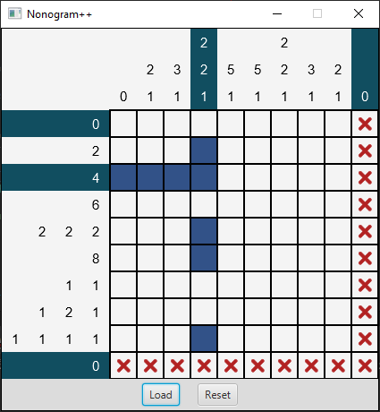
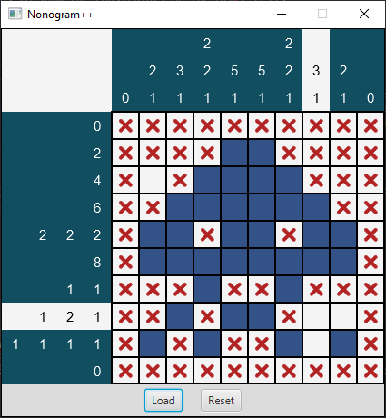
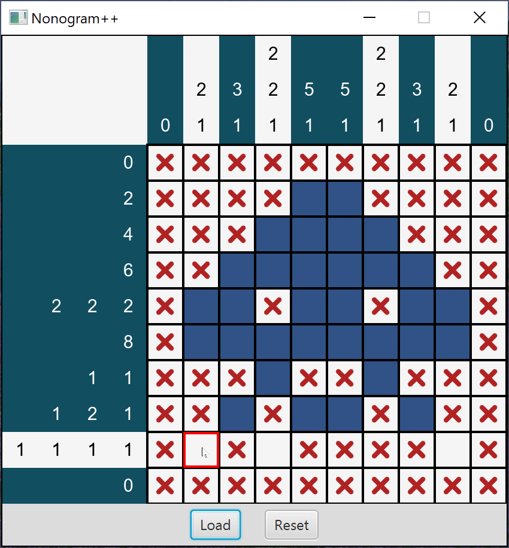
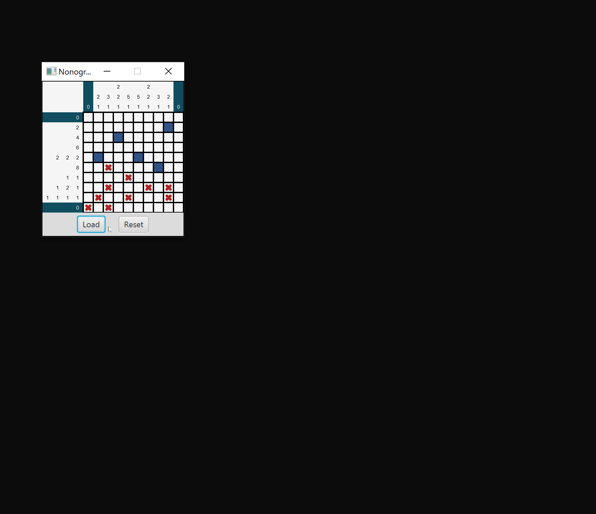

# Project 5: Nonogram Player


The program can run with zero or one command line argument. In both cases, a
default puzzle file is loaded.

Running our program with no arguments opens the default puzzle with a cell
size of 30:

```console
java Main
```


Running our program with a single argument of 50 opens the default puzzle with a
cell size of 50:

```console
java Main 50
```


Furthermore, you can load in different puzzles by clicking the **Load** button.
You can load in puzzles using the format defined in Project 4.<sup id="a1">[1](#f1)</sup>
For testing, we have included a few minimal puzzle files that do not contain
grid values at the bottom of the file (i.e., they only include the row count,
column count, row projections, and column projections).

Note that the background color of the clues in the first and last rows and the
first and last columns is midnight green instead of white.
This indicates that the states of the cells in these rows and columns solve the
clue numbers. In this case, the numbers are 0, so they are trivially solved by
the initial (empty) states.

Left-clicking on an empty cell changes its state to filled, which is represented
by the color blue. Right-clicking changes the state to marked, which is
represented by a red X. Marked cells are treated as empty when the game checks
whether a row or column is solved, but the marks can be used by the player to
label cells that they know are empty.

The next image shows the puzzle after changing the states of 8 cells to filled.
The new states solve the clues in the third row and fourth column, so the
background color of these clues changed to green. The leftmost filled cell
contradicts the clue in the first column, so its background color changed to
white.

The cells in the bottom row and right column have all been marked. This does not affect 
the clues, but it helps to show the constraints on the other cells.
For instance, if we also mark the cells in the top row and left column, it
becomes clear that the cells in the sixth row must all be filled.



The next image shows the puzzle with all but two of the clues solved.
Filling the cell in the eighth row and the eighth column will solve the puzzle.
Note that some of the filled cells in the previous image were incorrect, even though the background color of the corresponding clues was green.
Individual row and column clues usually have multiple solutions, and the background color will turn green for all of them.
To solve the entire puzzle, however, the clues for all the rows and columns must be solved simultaneously.<sup id="a2">[2](#f2)</sup>



The final image shows the behavior of the program when the player solves the
puzzle. An [Alert](https://openjfx.io/javadoc/11/javafx.controls/javafx/scene/control/Alert.html)
is displayed to notify the player. All of the marked cells are changed to empty
cells, and the color of the white square in the top-left corner turns green.
Additionally, the player can no longer change the states of the cells.



### Load Button

As previously mentioned, the **Load** button is used to load in a puzzle file.
When a new puzzle is loaded, the grid is resized to accommodate the new puzzle's
width and height. Furthermore, any existing marks are removed.



### Reset Button

The **Reset** button is used to clear all cells by setting them to the empty
state. If the puzzle was solved, the **Reset** button allows the player to solve
the puzzle again. After resetting a solved puzzle, the player should be able to
change cell states again.


### Main

The Main class has one instance method that sets the content of the Application window.
The start method constructs a NonogramPresenter instance and displays it.

* `start(Stage primaryStage)`: Perform these steps to display the options menu:

### CellState

This [enum](https://docs.oracle.com/javase/tutorial/java/javaOO/enum.html) is
used to represent the state of the NonogramModel grid.

### NonogramModel

This class encapsulates the state and rules of the game.
It stores arrays with the row clues, column clues, and cell states (EMPTY, FILLED, or MARKED).

### NonogramPresenter

The NonogramPresenter class represents the brain of our
program. The graphical view and model data are connected and synchronized
by the presenter.

Because the size of a NonogramModel is immutable, any size adjustments (rows or
columns) require re-initializing the model and view information. The model
reference is completely updated. The view reference stays the same, though
underlying data within the view may change.

### NonogramView

This class is a [BorderPane](https://openjfx.io/javadoc/11/javafx.graphics/javafx/scene/layout/BorderPane.html) that displays the row clues in the left position, the column clues in the top position, and the cells in the middle position.
  
### CellGridView

This class is a [GridPane](https://openjfx.io/javadoc/11/javafx.graphics/javafx/scene/layout/GridPane.html) that displays the cell states.

## Footnotes

<a id="f1">[1.](#a1)</a> The first line contains the dimensions of the cell grid: the number of rows *R* followed by the number of columns *C*.
The next *R* lines contain the nonogram numbers for the rows in order from top to bottom with one row per line.
Similarly, the final *C* lines contain the nonogram numbers for the columns in order from left to right with one column per line.
The remaining lines represent the rows and columns of the cell grid where 0s represent empty cells and 1s represent filled cells.

<a id="f2">[2.](#a2)</a> Not all nonograms have unique solutions.
For instance, if a checkerboard pattern with an even number of rows or columns solves a puzzle, it will solve the same puzzle if the empty and filled cells are flipped.
Our program will accept either solution.
